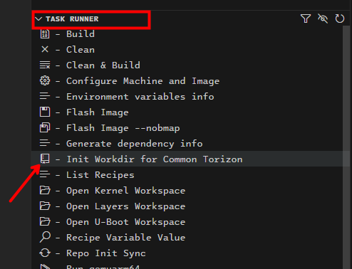
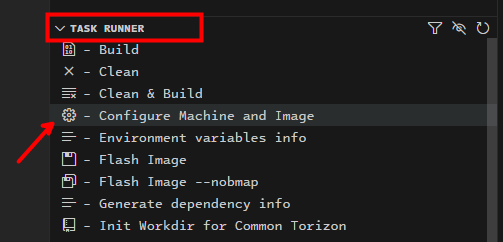
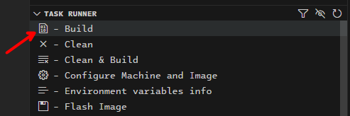

# HOW TO BUILD

General instructions on how to build the Common Torizon images.

There are two easy ways to build Common Torizon images, one is recommended for [CI/CD](#CLI)  use, and with VS Code for [development](#With-VS-Code) use.

> ⚠️ Also there is [Yocto "classical" way](#Yocto-Classical-Way) to build the images,  but this way is not tested and need some extra effort to setup the environment.

# CLI

## Prerequisites

> ⚠️ To have reproducible builds, we recommend to use containers to build the images.

- [git](https://git-scm.com/)
- [Docker](https://docs.docker.com/engine/install/debian/)

## Clone the Manifest Repository

```bash
git clone https://github.com/commontorizon/commontorizon-manifest.git
```

## Run the Build Script

```bash
cd commontorizon-manifest
./.scripts/build.sh <workdir> <machine> <release>
```

### Arguments

- `<workdir>`: The absolute path to the directory where the source code and the images will be stored;
- `<machine>`: The machine target to build the image;
    - The machine options are listed in the [https://github.com/commontorizon/commontorizon-manifest/blob/kirkstone/.vscode/machines.json](https://github.com/commontorizon/commontorizon-manifest/blob/kirkstone/.vscode/machines.json) file;
- `<release>`: The release type to build the image;
    - The release options are `dev` and `release`;
        - `dev` is for build the `torizon-core-common-docker-dev` image;
        - `release` is for build the `torizon-core-common-docker` image;

### Example

Example to build the `torizon-core-common-docker-dev` image for the `intel-corei7-64` machine:

```bash
./.scripts/build.sh /home/user/build intel-corei7-64 dev
```

The build can take a while, depending on your internet connection and how powerful is your development machine. At end if all goes successful , the images will be in the `<workdir>/torizon/build-torizon/deploy/images/<machine>` directory.

# With VS Code

## Prerequisites

- [git](https://git-scm.com/)
- [Docker](https://docs.docker.com/install/)
- [VS Code](https://code.visualstudio.com/)
- [VS Code Task Runner Extension](https://marketplace.visualstudio.com/items?itemName=microhobby.taskrunnercodeplus)
- [VS Code Remote Containers Extension](https://marketplace.visualstudio.com/items?itemName=ms-vscode-remote.remote-containers)

## First Steps

> ➡️ These are non specific steps, they are required for all the machine targets.

Clone the follow repository

```bash
git clone https://github.com/commontorizon/commontorizon-manifest.git
```

This repository contains the manifest files to use with the [repo tool](https://gerrit.googlesource.com/git-repo/). Also this repo contains a VS Code `devcontainer` configuration with all the required tools to build the images.

> ⚠️ We recommend to use the VS Code `devcontainer` configuration, for the ease of use, but you can use the `repo` tool directly in your development machine too. Using directly the `repo` tool will need to you handle and install all the required dependencies in your development machine.

Open the repository in VS Code, a notification will be shown then click in the `Reopen in Container` button. This will build the container with all the required tools to build the images. The build of the docker image can take a while, but it will be done only once. After the build is done, the container will be in a VS Code connected to the container.


### Initializing the Workdir

This step will fetch all the repositories and checkout the correct branch for each one. To start run the `.▶️ Init Workdir for Common Torizon`, click in it label on the VS Code task runner list:



This will take a while, wait until the task is done. You will have a message like this on the terminal:


### Choosing the Machine Target

After the workdir is initialized, you need to choose the machine target to build the image. To do this, run the `Configure Machine and Image` task, click in it label on the VS Code task runner list:



This will open a list with all the available machine targets, choose the one you want to build the image, by clicking in it label or typing the name, or part of it, and pressing enter:


After the machine target is chosen, is also asked which kind of image you want to build, choose the `torizon-core-common-docker-dev` option:


### Building the Image

After the machine target is chosen, you can build the image. To do this, run the `Build` task, click in it label on the VS Code task runner list:



> ⚠️ The first build will take a while, because all the dependencies will be downloaded and cached. This will depend on your internet connection and how powerful is your development machine. Remember you are building a Linux distribution from scratch, from source code, so it will take a while. Be patient.

# Yocto "Classical" Way

Follow the instructions on the [Yocto Project Quick Build](https://docs.yoctoproject.org/4.0.21/brief-yoctoprojectqs/index.html) to check for supported distributions and dependencies that is needed to build the images.

### Repo and Git

Since OpenEmbedded requires several git repositories to build our images we use an utility called `repo`. The `repo` manifest manages the various git repositories and their branches. (more on repo: http://code.google.com/p/git-repo/)

Install the repo bootstrap binary:

```bash
mkdir ~/bin
export PATH=~/bin:$PATH
curl https://commondatastorage.googleapis.com/git-repo-downloads/repo > ~/bin/repo
chmod a+x ~/bin/repo
```

`repo` uses `git`. Make sure you have it installed and your user name and e-mail address configured. Below is an example for Debian-based systems:

```bash
sudo apt install git
git config --global user.name "Little Jack"
git config --global user.email littlejack@example.com
```

### Initializing the Workdir

First we need to initialize the workdir with the manifest file. Create a directory to hold the source code and change to it. Then initialize the workdir with the manifest file:

```bash
mkdir ~/workdir
cd ~/workdir
repo init \
    -u https://github.com/commontorizon/commontorizon-manifest.git \
    -b kirkstone \
    -m torizoncore/common.xml
```

With the workdir initialized, we need to fetch all the repositories and checkout the correct branch for each one:

```bash
repo sync
```

### Setup the Environment

When the sync is done we need then to setup the environment to build the images:

```bash
MACHINE=<machine> EULA=1 source setup-environment
```

Where `<machine>` is the machine target to build the image. The machine options are listed in the [https://github.com/commontorizon/commontorizon-manifest/blob/kirkstone/.vscode/machines.json](https://github.com/commontorizon/commontorizon-manifest/blob/kirkstone/.vscode/machines.json) file.

### Building the Image

First of all, good luck, you will need it! Building the images will take a while, if you are lucky and there is no error or dependency missing.

Run the build command for development image:

```bash
bitbake torizon-core-common-docker-dev
```

Run the build command for release image:

```bash
bitbake torizon-core-common-docker
```

At end of the build, the images will be in the `<workdir>/build-torizon/deploy/images/<machine>` directory.
