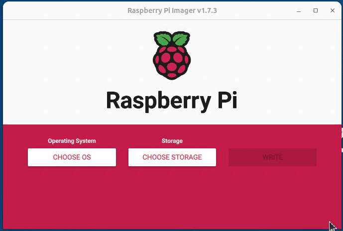

# Flash Common Torizon to SDCard for Raspberry Pi

## Prerequisites

- SDCard Class 10 or better, 8GB or more;
- [Raspberry Pi Imager](https://www.raspberrypi.org/software/);

## Rpi Imager with Common Torizon OS Image List

For have the Common Torizon images available on Raspberry Pi Imager, you need to use the [Common Torizon OS Image List](https://github.com/commontorizon/meta-common-torizon/releases/tag/v6.4.0-common) when starting the the Raspberry Pi Imager. Open a terminal and run the follow:

- Linux:

    ```bash
    rpi-imager --repo https://github.com/commontorizon/meta-common-torizon/releases/download/v6.4.0-common/os_list_imagingutility.json 
    ```

- Windows:

    ```powershell
    cd "C:\Program Files (x86)\Raspberry Pi Imager\" & rpi-imager.exe  --repo https://github.com/commontorizon/meta-common-torizon/releases/download/v6.4.0-common/os_list_imagingutility.json
    ```

Choose the option that match with your hardware:



Choose the storage to flash and click in `Write`. If all goes well you will have a SDCard ready to boot Common Torizon on your Raspberry Pi.
