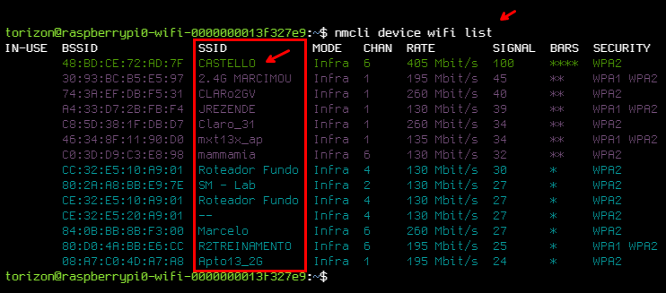
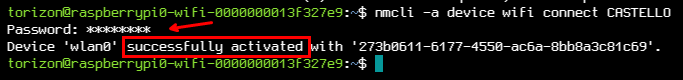

# Connecting to WiFi Network

This guide will show you how to connect to a WiFi network using the Common Torizon OS.

> ⚠️ To configure the WiFi network, you need to have one of the following options:
> - A monitor and a keyboard connected to the device;
> - A serial console connected to the device;
> - A network cable connected to the device and an SSH login connection.

Run the following command to list the available WiFi networks:

```bash
nmcli device wifi list
```

Then choose the network you want to connect to and run the following command:

> ⚠️ Replace `CASTELLO` with your network's SSID.
> You can find the SSID in the list of available networks, on the SSID column.
> 

```bash
nmcli -a device wifi connect CASTELLO
```

The command will prompt you to enter the password for the network. After entering the password, the device will connect to the network. You should see something like this in successful cases:


